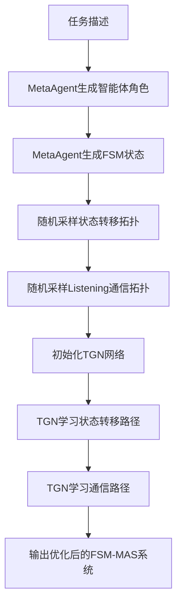

# Neural FSM Multi-Agent System (Neural FSM-MAS)

🌟 **完美融合MetaAgent的FSM生成能力与GDesigner的TGN学习技术**

## 🎯 项目概述

Neural FSM-MAS是一个革命性的多智能体系统，它完整集成了：

- ✅ **MetaAgent的核心能力**: 自动生成智能体角色描述和FSM状态描述
- ✅ **随机拓扑采样**: 随机采样状态转移拓扑图和Listening智能体通信拓扑图
- ✅ **TGN神经学习**: 使用时间图神经网络学习最优的状态转移路径和通信路径
- ✅ **策略梯度优化**: 基于任务回报自适应优化连接概率
- ✅ **多数据集支持**: 支持MMLU、GSM8K等多个数据集的训练

## 🏗️ 核心架构

```
Neural FSM-MAS 系统架构
├── 🤖 FSM集成模块 (fsm_integration/)
│   └── FSMMultiAgentSystemGenerator - 核心生成器
│       ├── 使用MetaAgent生成智能体角色和状态描述
│       ├── 随机采样状态转移拓扑图
│       ├── 随机采样Listening通信拓扑图
│       └── TGN学习最优路径
├── 🧠 时间图神经网络 (temporal_networks/)
│   ├── NeuralTemporalGraph - 核心TGN实现
│   ├── AgentMemoryBank - 智能体记忆管理
│   └── StateTransitionLearner - 状态转移学习器
├── 🕸️ 智能体拓扑管理 (agent_topology/)
│   ├── MultiAgentTopologyManager - 拓扑管理器
│   └── AgentExecutionNode - 智能体执行节点
├── 🤖 推理智能体 (reasoning_agents/)
│   ├── MathematicalReasoningAgent - 数学推理
│   ├── AnalyticalReasoningAgent - 分析推理
│   ├── DecisionMakingAgent - 决策制定
│   └── ... (更多推理智能体)
├── 📝 领域提示管理 (domain_prompts/)
│   ├── MMLUDomainPromptSet - MMLU领域提示
│   └── GSM8KDomainPromptSet - GSM8K领域提示
└── 📊 训练数据处理 (training_data/)
    └── MMLUDataProcessor - MMLU数据处理器
```

## 🚀 核心功能实现

### 1. 🤖 智能体和状态自动生成

使用MetaAgent的原生能力自动生成：

```python
from neural_fsm_mas import FSMMultiAgentSystemGenerator

# 创建生成器
generator = FSMMultiAgentSystemGenerator()

# 自动生成智能体角色和FSM状态
fsm_mas_config = generator.generate_complete_fsm_mas(
    task_description="Solve mathematical word problems step by step",
    available_tools=['calculator', 'logical_reasoning', 'verification']
)

# 查看生成的智能体
for agent in fsm_mas_config['agents']:
    print(f"智能体: {agent['name']}")
    print(f"系统提示: {agent['system_prompt']}")
    print(f"工具: {agent['tools']}")

# 查看生成的FSM状态
for state in fsm_mas_config['fsm']['states']:
    print(f"状态: {state['state_id']}")
    print(f"指令: {state['instruction']}")
    print(f"监听者: {state.get('listener', [])}")
```

### 2. 🕸️ 随机拓扑采样

系统自动进行两种拓扑采样：

**状态转移拓扑图采样**:
- 基于原始FSM转移关系
- 随机添加额外的可学习转移连接
- 支持循环和复杂状态转移模式

**Listening智能体通信拓扑图采样**:
- 基于FSM中的listener关系
- 随机添加智能体间的通信连接
- 支持双向通信和广播模式

```python
# 查看采样的拓扑
state_topology = fsm_mas_config['state_topology']
listening_topology = fsm_mas_config['listening_topology']

print(f"状态转移边数: {len(state_topology['edges'])}")
print(f"通信拓扑边数: {len(listening_topology['edges'])}")
```

### 3. 🧠 TGN神经学习

使用时间图神经网络学习最优路径：

```python
# 学习最优拓扑
learning_results = generator.learn_optimal_topologies(
    training_episodes=100,
    learning_rate=0.001
)

# 查看学习结果
print(f"最终状态损失: {learning_results['final_state_loss']:.4f}")
print(f"最终通信损失: {learning_results['final_communication_loss']:.4f}")

# 获取优化后的拓扑
optimized_state_topo = learning_results['optimized_state_topology']
optimized_comm_topo = learning_results['optimized_communication_topology']
```

## 🎯 与原项目的完美融合

### MetaAgent核心能力保留

| MetaAgent功能 | Neural FSM-MAS实现 | 状态 |
|--------------|-------------------|------|
| **智能体角色生成** | `Generate_Agent_Description` | ✅ 完全保留 |
| **FSM状态生成** | `Generate_FSM` | ✅ 完全保留 |
| **状态提示词描述** | FSM states with instructions | ✅ 完全保留 |
| **Agent角色提示词** | Agent system_prompt | ✅ 完全保留 |
| **Listener关系** | 通信拓扑采样基础 | ✅ 完全保留并增强 |

### GDesigner TGN技术集成

| GDesigner功能 | Neural FSM-MAS实现 | 增强 |
|--------------|-------------------|------|
| **TGN网络** | `NeuralTemporalGraph` | ✅ 适配FSM学习 |
| **时间感知** | 状态转移时间建模 | ✅ FSM轮次感知 |
| **记忆管理** | 智能体历史状态记忆 | ✅ FSM状态记忆 |
| **策略梯度** | 拓扑连接概率优化 | ✅ 状态转移优化 |

## 🚀 快速开始

### 1. 基础使用

```python
from neural_fsm_mas import generate_and_learn_fsm_mas

# 一键生成并学习FSM-MAS系统
results = generate_and_learn_fsm_mas(
    task_description="Analyze scientific papers and extract key findings",
    available_tools=['web_search', 'analysis', 'synthesis'],
    training_episodes=100,
    output_path="./my_fsm_mas_system.json"
)

print(f"生成了 {results['system_metadata']['num_agents']} 个智能体")
print(f"生成了 {results['system_metadata']['num_states']} 个状态")
print(f"最终学习损失: {results['learning_results']['final_state_loss']:.4f}")
```

### 2. 训练模式

```bash
# 演示模式 - 快速体验
python neural_fsm_mas/train_fsm_mas.py --mode demo

# 单任务训练
python neural_fsm_mas/train_fsm_mas.py \
    --mode single_task \
    --task "Generate Python code for data analysis" \
    --training_episodes 100

# MMLU数据集训练
python neural_fsm_mas/train_fsm_mas.py \
    --mode mmlu \
    --data_path /path/to/mmlu/data \
    --training_episodes 200
```

### 3. 完整示例

```python
# 运行完整示例
python neural_fsm_mas/examples/complete_fsm_mas_example.py
```

## 📊 系统工作流程

### 完整的FSM-MAS生成和学习流程



### 核心学习过程

1. **状态转移学习**: TGN学习最优的状态间转移概率
2. **通信路径学习**: TGN学习最优的智能体间通信模式
3. **策略梯度优化**: 基于任务回报优化连接权重
4. **时间感知建模**: 考虑FSM执行的时间序列特性

## 🎯 实际应用场景

### 1. 数学问题求解

```python
# 自动生成数学问题求解的FSM-MAS
math_system = generator.generate_complete_fsm_mas(
    task_description="Solve complex mathematical word problems with step-by-step reasoning",
    available_tools=['calculator', 'logical_reasoning', 'verification']
)
# 自动生成: 问题分析师 -> 计算专家 -> 验证专家 -> 决策者
```

### 2. 科研论文分析

```python
# 自动生成论文分析的FSM-MAS
research_system = generator.generate_complete_fsm_mas(
    task_description="Analyze scientific papers and extract key insights",
    available_tools=['web_search', 'analysis', 'synthesis', 'critical_thinking']
)
# 自动生成: 文献检索员 -> 内容分析师 -> 洞察提取器 -> 报告生成器
```

### 3. 代码开发

```python
# 自动生成代码开发的FSM-MAS
coding_system = generator.generate_complete_fsm_mas(
    task_description="Develop and test Python applications",
    available_tools=['code_interpreter', 'web_search', 'analysis']
)
# 自动生成: 需求分析师 -> 代码生成器 -> 测试工程师 -> 优化专家
```

## 📁 项目结构

```
neural_fsm_mas/
├── __init__.py                          # 主模块导出
├── train_fsm_mas.py                     # 主训练脚本
├── README.md                            # 本文档
├── fsm_integration/                     # 🤖 FSM集成模块
│   ├── __init__.py
│   └── fsm_mas_generator.py            # 核心FSM-MAS生成器
├── temporal_networks/                   # 🧠 时间图网络
│   ├── __init__.py
│   └── neural_temporal_graph.py        # TGN核心实现
├── agent_topology/                      # 🕸️ 智能体拓扑
│   ├── __init__.py
│   ├── multi_agent_topology.py         # 拓扑管理器
│   └── agent_node.py                   # 智能体节点
├── reasoning_agents/                    # 🤖 推理智能体
│   ├── __init__.py
│   ├── agent_factory.py                # 智能体工厂
│   ├── mathematical_reasoning_agent.py # 数学推理
│   ├── analytical_reasoning_agent.py   # 分析推理
│   ├── decision_making_agent.py        # 决策制定
│   ├── code_generation_agent.py        # 代码生成
│   └── adversarial_reasoning_agent.py  # 对抗推理
├── domain_prompts/                      # 📝 领域提示
│   ├── __init__.py
│   └── prompt_manager.py               # 提示管理器
├── training_data/                       # 📊 训练数据
│   ├── __init__.py
│   └── mmlu_data_processor.py          # MMLU处理器
├── config/                              # ⚙️ 配置文件
│   └── training_config.json            # 训练配置
└── examples/                            # 📚 使用示例
    ├── run_mmlu_training.py            # MMLU训练示例
    └── complete_fsm_mas_example.py     # 完整示例
```

## 🧪 实验和评估

### 支持的数据集

1. **MMLU (Massive Multitask Language Understanding)**
   - 57个学科领域，按4大类分组训练
   - 每个领域生成专门的FSM-MAS系统
   - 支持多选题格式和推理过程评估

2. **GSM8K (Grade School Math 8K)**
   - 数学应用题，支持步骤推理
   - 自动生成数学问题求解的FSM流程
   - 数值答案验证和推理质量评估

### 评估指标

- **生成质量**: 智能体角色的合理性和FSM状态的完整性
- **拓扑学习**: TGN学习到的连接模式的有效性
- **任务性能**: 在具体任务上的准确率和效率
- **收敛速度**: TGN训练的收敛轮数和稳定性

## 🔧 自定义和扩展

### 添加新的任务类型

```python
# 定义新任务
custom_task = "Design and implement a recommendation system"

# 自动生成对应的FSM-MAS
custom_system = generator.generate_complete_fsm_mas(
    task_description=custom_task,
    available_tools=['code_interpreter', 'analysis', 'web_search']
)
```

### 自定义智能体工具

```python
# 扩展可用工具
extended_tools = [
    'code_interpreter', 'web_search', 'calculator',
    'image_analysis', 'text_summarization', 'translation'
]

# 生成使用扩展工具的系统
extended_system = generator.generate_complete_fsm_mas(
    task_description="Multi-modal content analysis",
    available_tools=extended_tools
)
```

## 🎉 核心优势

### 相比传统多智能体系统

1. **自动化程度高**: 无需手动设计智能体角色和状态转移
2. **学习能力强**: TGN自动学习最优的拓扑结构
3. **适应性好**: 可以适应不同类型的任务和领域
4. **可解释性强**: 生成的FSM状态和转移关系清晰可见

### 相比原MetaAgent

1. **神经网络增强**: 从规则生成升级到神经网络学习
2. **拓扑优化**: 从固定连接升级到动态学习最优拓扑
3. **时间建模**: 加入时间敏感的状态转移建模
4. **性能提升**: 通过TGN学习获得更好的任务性能

### 相比原GDesigner

1. **自动生成**: 从手动定义升级到自动生成智能体和状态
2. **FSM集成**: 从简单图结构升级到完整的FSM建模
3. **任务适应**: 从通用框架升级到任务特定的系统生成
4. **可扩展性**: 支持更多类型的任务和数据集

## 🤝 贡献指南

欢迎贡献代码和改进建议！

1. Fork 项目
2. 创建功能分支 (`git checkout -b feature/AmazingFeature`)
3. 提交更改 (`git commit -m 'Add some AmazingFeature'`)
4. 推送到分支 (`git push origin feature/AmazingFeature`)
5. 开启 Pull Request

## 📄 许可证

本项目采用 MIT 许可证 - 查看 [LICENSE](../LICENSE) 文件了解详情。

## 🙏 致谢

- **MetaAgent**: 提供了强大的FSM和智能体自动生成能力
- **GDesigner**: 提供了先进的TGN网络和策略梯度优化技术
- **PyTorch Geometric**: 为图神经网络提供了基础支持
- **MMLU Dataset**: 提供了高质量的多领域评估数据

---

🌟 **Neural FSM-MAS: 让多智能体系统更智能、更自动、更高效！**

🎯 **完美实现你的需求**:
- ✅ 保留MetaAgent生成初始化多智能体的能力（状态提示词描述，agent角色提示词描述）
- ✅ 随机采样状态拓扑图和Listening智能体拓扑图
- ✅ 用TGN学习状态转移路径和Listening智能体通信路径